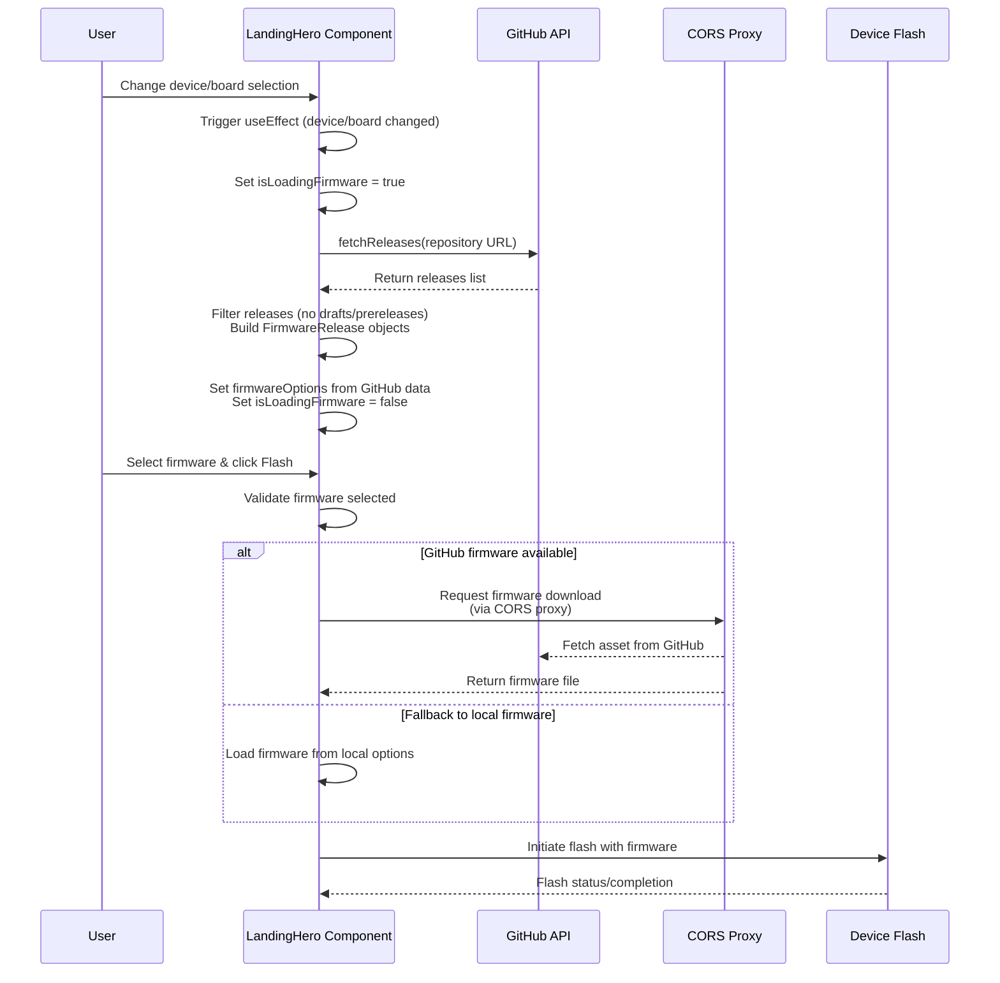

# bitaxeorg/bitaxe-web-flasher pull request #28: flash from github release

> Source: https://github.com/bitaxeorg/bitaxe-web-flasher/pull/28
> Collected: 2026-10-07
> Published: 2025-12-06

- Repository: bitaxeorg/bitaxe-web-flasher
- Type: pull request
- Number: 28
- State: closed
- Author: WantClue
- Opened: 2025-12-06
- Closed: 2025-12-07
- Labels: enhancement

## Description

removes the need of uploading firmware binaries thanks to @shufps 

<!-- This is an auto-generated comment: release notes by coderabbit.ai -->

## Summary by CodeRabbit

## Release Notes

* **New Features**
  * Firmware versions now load from GitHub releases, with automatic fallback to local firmware when unavailable
  * Added loading indicator while fetching firmware versions

* **Localization**
  * Firmware loading status message now available in 9+ languages

✏️ Tip: You can customize this high-level summary in your review settings.

<!-- end of auto-generated comment: release notes by coderabbit.ai -->

## Comments

### coderabbitai[bot] on 2025-12-06

<!-- This is an auto-generated comment: summarize by coderabbit.ai -->
<!-- walkthrough_start -->

## Walkthrough

This PR introduces GitHub-based firmware fetching for device flashing. It adds a releases fetcher to retrieve firmware from GitHub repositories, implements fallback logic to local firmware options, adds loading states during firmware retrieval, simplifies the firmware data structure by moving repository references to device objects, and updates the flashing workflow to support downloading firmware from GitHub releases via a CORS proxy.

## Changes

| Cohort / File(s) | Summary |
|---|---|
| **GitHub Firmware Integration**   `src/components/LandingHero.tsx` | Introduces GitHub releases fetcher (fetchReleases) that builds FirmwareRelease objects from repository data; adds local vs GitHub firmware source selection with fallback logic; implements isLoadingFirmware state with UI placeholder; updates flashing path to download from GitHub releases or load local firmware; adds error handling for network and data absence scenarios; injects effect to refresh firmware options when device/board changes. |
| **Firmware Data Structure**   `src/components/firmware_data.json` | Adds `repository` field (string) to each device object; removes `supported_firmware` arrays from all board objects, simplifying board declarations to contain only `name` field. |
| **Localization Updates**   `src/i18n/locales/{en,de,it,pt,ro,ru,sk,tlh,tr}.json` | Adds "loadingFirmware" translation key under the "hero" section in all locale files with appropriate language-specific strings for firmware loading UI feedback. |

## Sequence Diagram

## Estimated code review effort

🎯 3 (Moderate) | ⏱️ ~20 minutes

- **src/components/LandingHero.tsx**: New GitHub API integration with fetchReleases, loading state management, and fallback logic warrants careful review of error handling and data parsing.
- **src/components/firmware_data.json**: Structural change removing supported_firmware arrays requires verification that all board/device references are compatible with updated schema.
- **Locale files**: Confirm all 9 locale files are consistently updated with identical key name ("loadingFirmware") under the "hero" section.

## Possibly related PRs

- **#19**: Modifies the same src/components/LandingHero.tsx file's flashing initialization flow and adds selectedFirmware validation/disabled logic, likely overlapping with firmware selection handling in this PR.

## Poem

> 🐰 *Firmware now flows from GitHub's great tree,*  
> *No more just local, for all to see!*  
> *Loading states dance as versions appear,*  
> *Fallback so graceful when data runs clear,*  
> *Your device flashes faster, hooray!* ✨

<!-- walkthrough_end -->

<!-- pre_merge_checks_walkthrough_start -->

## Pre-merge checks and finishing touches

❌ Failed checks (1 warning)

|     Check name     | Status     | Explanation                                                                          | Resolution                                                                     |
| :----------------: | :--------- | :----------------------------------------------------------------------------------- | :----------------------------------------------------------------------------- |
| Docstring Coverage | ⚠️ Warning | Docstring coverage is 0.00% which is insufficient. The required threshold is 80.00%. | You can run `@coderabbitai generate docstrings` to improve docstring coverage. |

✅ Passed checks (2 passed)

|     Check name    | Status   | Explanation                                                                                                                                                                   |
| :---------------: | :------- | :---------------------------------------------------------------------------------------------------------------------------------------------------------------------------- |
| Description Check | ✅ Passed | Check skipped - CodeRabbit’s high-level summary is enabled.                                                                                                                   |
|    Title check    | ✅ Passed | The title 'flash from github release' directly and clearly describes the main change: enabling firmware flashing from GitHub releases instead of requiring uploaded binaries. |

<!-- pre_merge_checks_walkthrough_end -->

<!-- finishing_touch_checkbox_start -->

✨ Finishing touches

- [ ] <!-- {"checkboxId": "7962f53c-55bc-4827-bfbf-6a18da830691"} --> 📝 Generate docstrings

🧪 Generate unit tests (beta)

- [ ] <!-- {"checkboxId": "f47ac10b-58cc-4372-a567-0e02b2c3d479", "radioGroupId": "utg-output-choice-group-unknown_comment_id"} -->   Create PR with unit tests
- [ ] <!-- {"checkboxId": "07f1e7d6-8a8e-4e23-9900-8731c2c87f58", "radioGroupId": "utg-output-choice-group-unknown_comment_id"} -->   Post copyable unit tests in a comment
- [ ] <!-- {"checkboxId": "6ba7b810-9dad-11d1-80b4-00c04fd430c8", "radioGroupId": "utg-output-choice-group-unknown_comment_id"} -->   Commit unit tests in branch `remove-hard-files`

<!-- finishing_touch_checkbox_end -->

<!-- tips_start -->

---

Thanks for using [CodeRabbit](https://coderabbit.ai?utm_source=oss&utm_medium=github&utm_campaign=bitaxeorg/bitaxe-web-flasher&utm_content=28)! It's free for OSS, and your support helps us grow. If you like it, consider giving us a shout-out.

❤️ Share

- [X](https://twitter.com/intent/tweet?text=I%20just%20used%20%40coderabbitai%20for%20my%20code%20review%2C%20and%20it%27s%20fantastic%21%20It%27s%20free%20for%20OSS%20and%20offers%20a%20free%20trial%20for%20the%20proprietary%20code.%20Check%20it%20out%3A&url=https%3A//coderabbit.ai)
- [Mastodon](https://mastodon.social/share?text=I%20just%20used%20%40coderabbitai%20for%20my%20code%20review%2C%20and%20it%27s%20fantastic%21%20It%27s%20free%20for%20OSS%20and%20offers%20a%20free%20trial%20for%20the%20proprietary%20code.%20Check%20it%20out%3A%20https%3A%2F%2Fcoderabbit.ai)
- [Reddit](https://www.reddit.com/submit?title=Great%20tool%20for%20code%20review%20-%20CodeRabbit&text=I%20just%20used%20CodeRabbit%20for%20my%20code%20review%2C%20and%20it%27s%20fantastic%21%20It%27s%20free%20for%20OSS%20and%20offers%20a%20free%20trial%20for%20proprietary%20code.%20Check%20it%20out%3A%20https%3A//coderabbit.ai)
- [LinkedIn](https://www.linkedin.com/sharing/share-offsite/?url=https%3A%2F%2Fcoderabbit.ai&mini=true&title=Great%20tool%20for%20code%20review%20-%20CodeRabbit&summary=I%20just%20used%20CodeRabbit%20for%20my%20code%20review%2C%20and%20it%27s%20fantastic%21%20It%27s%20free%20for%20OSS%20and%20offers%20a%20free%20trial%20for%20proprietary%20code)

Comment `@coderabbitai help` to get the list of available commands and usage tips.

<!-- tips_end -->

<!-- internal state start -->

<!-- DwQgtGAEAqAWCWBnSTIEMB26CuAXA9mAOYCmGJATmriQCaQDG+Ats2bgFyQAOFk+AIwBWJBrngA3EsgEBPRvlqU0AgfFwA6NPEgQAfACgjoCEYDEZyAAUASpETZWaCrKPR1AGxJcAZh7SIsJA+FCyQROqw2AKQFCReASSQkAYAco4ClFwATAAcyQYAqjYAMlywuLjciBwA9LURuFECGkzMtWq4aAAeJPgURB3qPSRgAO4kAmB+AbCUtdzYHh61eQWFiFmQAOqYuADCHthJKQDK+NgUDEkCVBgMsFxxzPhSYLDOtNPwXsgp0M5SLhILdMA8uMxtFgzl1cNgavxuGQCjYSBJ4CQJhQEQAKDD4ciQDxIGi0ACUBRKKniCLIH3uJDYGGBKX2cWodHQnEg2QADNkAKxgACM2TAvIAbNBssKOAKAMwcYUAFgAWkYACLSBgUeDccQEjgGZ6vaSQJpJcic/A+SDYbgefBoWjwDBEYLwCjMMbOG6u5wY5BNTAAayD+EgAAFAtgfNUjPpjOAoGR6DacARiGRlKSFKx2FxePxhKJxFIZPImEoqKp1FodImTFA4KhUJgM4RSOQqLm2kzuVQxvZHJCXCDK4plLXNNpdGBDEnTAZEFdam1uAT2IhalSMC63QAJSj4DS4RDdI0AImvBgskAAggBJLPdjn0BxOMfph6YUiIBMPrQtDIAA4uoB7RGAAiJPQPiet6vrBCQuAPK67p+PgYxcK6uChLQ2DXMgaCQGBuAQTEcQJJsyA+MhDyUJAOK0ShsColR0gUsGwICNgPzAZAABi8E+nEbEkIkxYiGINGhMwsQkBuiDqP08iUeJ1EADQeh4NC6m6PBxGpiTbrQVA+Ge6B7ugiCbBZkIsWh6Agk6FBfIgSIMPAcEMJAGBoMwjncNQukYBoBhQI+zJ4QRZqOgwaAeJAEigeB0Qel6IlJIgFxXNIXDrngsX4PFHhCRlvoAPL6vABIyWEAgufQtDUMRmD0PCZpweVcRVQaGDIDipHkRSYxzFgaASNo/gCF4ADc/AWhQYxIEkPgJR4MhoAwIbmhGcUJYifWIGFUAAKIYPShH2PEpY1VgGFYegQE0cJiGOs6jmILCSQ4kgJROvuRBlQhcQUm19iwJhRFEgDgX+NckMeNW81dSDWU3WI/S+ZhdrUZAJCRAxQ2QdWkiclI2J3cgWP7YlFNKbVkBKEie6OQS6CTT8Kg/OosjzS6iAqL86Vo9dXiY3wo0/Ek72AydkCnd0NB7sgSjotcHSNUzJBrUsFkEMO3AbhQwJxIpyljnEtFxAyCJq/A1ySaWyBEFC8nmwQY5wfEtDzQ1nza7rOku27flsJZ9C4LISLvvaxukgA+qjmXoBQVDyOojIDfTd0LNQsBkvLkVSRZOu0WIu3ySE0hBMniH4NVjOjci9sa/7rmMPSpDzbh8BEKQ2Iwx9+lfRyTOXI5zEPBHPAN0sHIvd1JC9VT6AMEwrloR4sjy4U3DNTQNH+IEgX51w+F6e6o8mwJx8IG6WnxVgtCYRgssiynIRhMTFE3cZjHwkcsRfYFUbCnAMvgbosgKQ0wBjDEqH9EJwV+PNektBhaUFCIPcGtlkCjzhERde/RAbb13vvBeiC4hD0BjPTBWM0HEjdOUNqwsVCbAZPwW0P8mYtX4HwWmlCkhECoNcHwSxt5aSaKEZa+kOoUGmFtRybAbJoD/Pwe6U1LjSHlgAWVdFjQoj5aj4KSEwOYDMMBcASn3fq1DPrfUgMtJogixa3XZuDAW60obBDvo5KWXgXGoFlmhMKt5LDmEsPeHSOZV4GwtNrBg/geyr3TCQbo8drR8EWDNB2+NmTqEDABVIEYfxujNAbNJGTaALGiMSHySkiB+ThHEVWyFSx0A0IxKwtTcn3isI+YcFA1pXWeG7bA9wu4dLJBEyAOjMBeWkMCISAT7x+W3gAL0oEYU6X14D2U5FWJIcR0SYnxj4Hw/RuQHj7rAAw15LwJiXCuBga4WAbnIMybcdc4gJwPmgDQQhsqWLuTeO8T4Xw5k5B+Uc8hvyTP/OFQCSh6DEWyXUj0Pt3b4CUp7WQXAvqX0ruJaerckiCBLnaPcDFSUDRIBoIgGgtJzO6FpQoOkqBaVOPaDlJF/KQlZeytAR4WWQC5bwIVaStKpEoLQPR3YpUytSBVU4ZItI4Wip5fSxEzbYotvIYoJRGKMn1PIAlk8sbZTYIXFIUBUQvCkJHOYhsqlJ1elQ5w6c6pyTRJQeQ7c0wljEFpBI6J9IEm3uaJ1YdVoYiRsELG/qBrwA0HSrS/qElJOoKvJSzAHReXkF/OSABvXy/kSBaQcEbS5dBXVL0gAAX0riW6NDbC5GBmVE3SWbGZxKdUoRJzhu22NSek6taYsk9J8uwAp0gAJCUxc6ZFXAAAGOqcUqWXYxKOSJ8W9zdBSV0jBj7bnJaWc+aIHZJHYLqM04zqyQGXc815ubNyfNqN8kgvyWoAqBZui5fAaXDmngEB9zLl1aWXWy3CaBwMPtFdymDEGQJ8sQw+qDVBhWweXWKjDaSsPStcnKygsHwbLoI7QJVpxl3y3nXGk0DqV2VpdR+zdOIPVoFhbaD98kN7AQpIW5yAdT3SUfl3Ry6b+2ZqOsEWSD6S2XmjZeLgl5gDwFoHoS8WlLxMbHbWtGSnIAAG0NAmYALoNs3QbZd8nFPKdU+py8Fm16hBsugZYgnXLHRmXMjACyvqCWlg+NZshNkUG2bs/Z9BDnyROUOMulyuA6LoPARwIKHnhSeaueAwpcgYFqLTaQtQlA/sNGlsJD5nxdkhbHT8nHO6/lnYi+8QFOTEXIEOWm8B1lDvsHu90l5glumBplRzTigiTSOEkS8VIlABaXmAAAapQCxZATMaEc66JSs34mXjmKERzmwxB3U4fYLLOW8sFZMnSwFBItLOiEFtdgRLugkknm60YlE3yQBDCQWQx1IDFO1l4aTWMXgum8kO8M+MXu7P0j9v7Wlw3yHbGgbARB+w9fTPEgrkBITcE6S2ZA6rFAxWhu1yAhjzRpOBP+ux+luMNyOnd85t19ICwdBxkEeBsbAiYFFfAiUHqhIAt0nJU78lRwzYOvq9Wyk1AMMkKAVhQhIhNsjlrtAuCRVOy87LuX8vFQSoV4rN2MBaTvQxHbe38COeE7gO7GvIADdhkN97BnpvOiSMN30i3lt3VWyZy8oSlWpFOuF8QkWFCzeORiOL5yEuzOS6l+5jywBGCfXri7hvfi1FW6bq8oLImVezD2KFI5nB1dKX+ACzXkVOXJ517rMuzX6UG0Dd7lL73W7Vfz/Cmr+v/WHuhDvOdaprcc7T+JeegXyWypca4nTAf4EWrLtRBs+e4QFz4nGWM6F8AYWhea+Joevbh795AYOvIYnHfJe1HT22IoANK/aekuh9bfvdxE3Yeu3D7rebvTGQSSEfTO310u1z1ClN2XXDz2S+2ixj1OXixNkSyT2YDKwyzT2XFAKzxKkKzrHzzKzBWL1fFzGhQrxOyr0aygFr1a18lOUbx62vXkGdyH0/xIEcwtz4HiWt2uiO3ZjG0jSSAm2OCd32ADHin7AjFH180EXHwJwQCJyInGiAgKQJCPwjDSVP3dHh2QCxCOUZFNBv0v29loDuysg31CEF0dCHFGU20pUoNoGF3K07RiR7QjHiUk2lxSVtEqTHT4R4EnTyXEHECoIBxKXhUrgaSaS0Wph8NHRNjoBqTFyCJnX+xxGlSHHh1f05ANmIgAClTgKpUhzQ7hEB/AZcgD1Docqkkj0Vt0yU+AxF7gZdPDkkm5KAkhjDr8NBplysfM/MllAtVkEoQstkDAdkI84DJwYtY8zl/1uQksXRk8bwMD09sCDdcDtx9QStgUU8iCIVS8asYUKD4Ua9Hc2t6Ds8utGCopmCP83dO9LcnVdtjwDs3EsABD4kW9+sxC04SBXY9wpDlsABXs0F+WQwPRfCMZfPbVfcpPafACIHyLGIXB/MFaJNo2xXtJIVoyHE7XwhIm/NFXJadEIhFKAPEcIhrRAXoiY2A3saYhAuPeYlApYtAlPVYrA3Xc7DYo3bcUIHYgvB5fYqrQ44cWrE46kowWvMnS4kqa4mXJgp3e4peDgqlLg5463N4vgs3RxSIQQyAGwFgeZdsaDfqco47S8U4JIAAO/uGcAYEAGBAJKP3cZQLWbD9OQsIhaWEygqHR0JE/wglAiZpEgKovfSAA/MNPgCwrfB6NzLtI6Jw9ExM2JdwvtUQKTbw6ovwrGYk8XYIwpRFbzeZWifzZZJIYYjZMYukyPeAi9RA+PZAxPNk9AiATAjPHk8AigbAQUwgovA4r7Mgr8W0P0s4/iC4ocM0sonrLIlU0WAQ4QqbQAdBBAAGEEAGYQQAARBABhEEAHYQQALhBVzIBAAmEEAFYQTcwAQRBAAOEEAE4QSAQAfhBNzAA+EEAAkQK848/cq88fFAfqNTJIbg48XgmXdMTssA7PQrHsnYqEn0hiTID4dELGLGWMqwnGP0+aRYSiZHOgjrK4zZd8PrJwqAZ/dXN/ZdeczKb/LAX/Zdf/PUpoQ9IAh9UCnAvk2oSCqAyAQAJMI/9jwNByLfRN0ABeJ3Ncrcvcw8k88868u8x81898z88fGAusxkhs5khPRYlLdklY9stY7ksCzY4xEMPsvYgc0Uoc8vEcuE8kpFWghvXC2cl/fiqhTgyMwCz4p1Jcp3VINAQAWEAABbroSaXzIQygdZeAPyiE9beQ1sXvUnbC4sTYCgSaGaf86neNPgYibjNvXrMeMbC4YEBKXSRyTQ2Hd0AM3JXfNOehFhEJNEyJDEvE7EqXTE2InMwk/w/MlIskgCYi7IzXd/F3dvJeSip2CuEAvSlinPRAIyji7ioKZxGi48TdRchKEQ5dS8by/ywK+ZEKigMKiKz0wPaAvo0sxZALFZYLULJSqY6PVSuY9S1AtszLCa3knPXADwWAYywvCrQc0giyyvU4gwe8eK6ci09mJUpypIH0IiR3FygC0IICu6HvTfPvIBeK/M1664lK3rQlFgwGNg0bfU+JTyhTIgfAAAR1FX+KCCOAAHIvSl8V8/TK5yrkSYyCRN8UKxge4FDqi2ogwnVbITtG9OQdDaFR08ZJy6cr4HFpp4hCLrAVdKBJdF06AV1IaRrqLaKxtD1xrahM9XrCt3rPqoDrqGTbrYt7rmyNLlj0sdKuT9auzwLtxcIvrhTTKS9zKJS4UpSmtzj4qGDFTbjpa2CfyDToBLgQwkAabwLGJmLDaXaKAdiKQ4anUeDDs+poq8E45iRyknVlFBZSAncABNNAdZQARkAPBy65JEAAAfigWu5gLwXUSAWQWukMLwXzWQfob8g2V0F0eKGgFxaQoiKhNvaC5mg2VmrSCMqMogRHdm/nLmwijtBq6TJq3EkHOIqpDqwI0kospXJWtXPq9WwatgkaqfeI3MCOigKOwIeBI3Ua4EfaXMagJi9Y8A12ji1O4A2i+HTpBbVa7wEusuyu6u+weuxu5unQNujusgeAbupOwPM2g5FSy2pAhYx6jkxMAwJsPJNMW0VHTMMyhk/MZkJ4NAIcYcv1CcasFQToesOcQwPBvsdQBONTRABOJkmta+YEHBvBgATgAHZ5RRGGAhG8gBHchhRhQpH5RshJgBGfAZHchcgfAhGBG0BF1aBhQBBeQVQ0AJQmHFwoBWHcB2HgIuHVKa1UxjG8HeBP02ABhP16JtpOHeHjGDAi0FcnckBbAAAhOKH7WgfYFgfsKwbFUkAzNaDactHx7TSGJYWgQJ4qEMWwaJhKTYDSeJpACqCmXUFrDADJ2J7J5IS8F0WgGwcZDUYqU4PrRAfYOYbaAzXCY4Upp3CpqpjAdwd6kgRp0QEMFpnsuJspzp6p7UXURuDAfp5p3wTJkZ5U10YJx8GyY4RAOpigd3TTeJ4+A4JpkMVEBwYOAzQzHx5Ibx5IS5p3VxkMbytgd3LURAHUPUGXGZwZ9pq57TWEeEIZtps5y5y8SpfwJpO6d3N5+wKOo2TkKAUJpQGweh9QQATAJkAEAiBYAwAvApBEpqGUBkAyAhYOltmrmymwd2DlMRJfM3QiXiXLx+g+5/QPA3m7myWOmJmXnQX/n60PnIALmaWbnmX3cemAkbnqXPn8EfmuBWmFnPmgXMAh1BWnVgiAlaaZh76BNGhmh5J2JaamZPRSwI1wZElxIKAI0lAnndRMgBbOi3ZKCuB8Wcl6cO9VX750JZNuEjI8ZNsaBnQTs4hybeJCV7RZZOQ1A/Ib1jpRWAXSX3cKW0JI2ym4g+c4IiAtFimsn/mym6WIg1kmWy13clX2DOXuXeXPn+W83lMamGBvjIBQmKZVF2DuWynxXEA03pWAXZWQWCQHnipq2mA62i7UBeQNBeReQABSRxBAaeGKhwc5B2DEZkeQ/Q/1vVx1FpRGegVAXIIdkd0d9bRtp3FpAXPAUF5TYui4RgdsHsrAZdSMQ5GsToWcEhnEnt+pyzCMPZXgU0JmF9wlPt5QUgPdjNp3aN8l5wSlogeNp3LNhl3N+55TF+Kt+ph5K5+tHx0zdpgbAIXAWwR555qZ93YUNAAR+UZUEgYUAUARkgZUXkNR2iEjgR4UWgSjvIcR0QEgCUZUNAGRiUNAXkeUXIbIARiUAR7IZUQT+UAUBgJQKRmUIR2gLdgQAUAUalzDr6WwIVlly8XIZUAQJQHLCUHwCUIRwx3kEgSYcj+KDjiUBgYT3IaT3T6zgUbIRdJTtAAUZUETnwZUIR3kBgTj7IeUYUBgXIAQIRhgSTlThD742t/9kgSKEKBKOpjkAzEtp3J9dcV9M8HcNqNCI8AUs8boFLoDy8AgLoUqcZHUltrgYUfdy8Joyr7YSISt74qryAXkTlnx1D1D3B5MAyRxygUgBOG5zh2x/QIAA -->

<!-- internal state end -->

### ghost on 2026-01-28

😬😬
